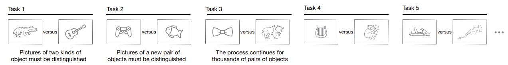
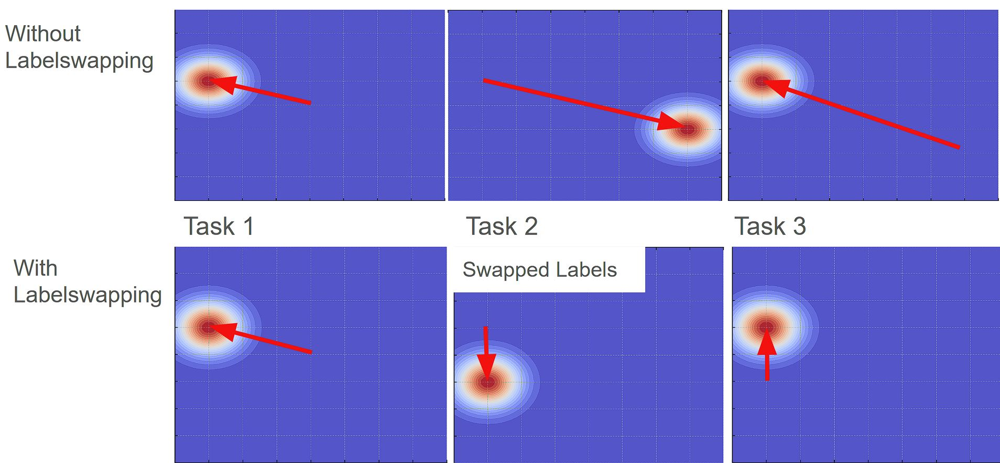

# Machine Learning 2: Experiments on the Plasticity-Stability Dilemma in Continual Learning

## 📌 Problem  
In our continual learning setup, an agent must sequentially differentiate between two downsampled 32×32 ImageNet classes. The agent has access only to the current task's data and loses it as soon as the next task begins.  

  

## 📊 Evaluation  
Traditionally, stability is measured by evaluating an agent's performance on Task *m* after training on Task *n* (where *n > m*), and plasticity by the performance after *x* number of epochs with ongoing tasks. However, I propose a different approach:  

🔹 **Measuring stability based on the number of epochs required to relearn Task *m*** rather than just assessing its retention.  
🔹 **Measuring plasticity as the number of epochs required to learn a new task to a certain performance level.** rather than its performance after a set amount of epochs.  

This approach aligns with how humans retain, recall, and acquire knowledge. Humans tend to remember tasks better when they are repeated closer to the initial learning period. However, as time passes without repetition, knowledge fades, requiring more effort to relearn.

## 🏗 ReLU+Down Activation Function  
This activation function aims to prevent the loss of plasticity in continual learning that our model experiences when utilizing the standard ReLU activation function. ReLU+Down achieves this by being more expressive and maintaining a gradient even in the negative region.  

  

## 🏗 Decreasing Backpropagation  
This approach **mimics human memory** by allowing:  
✅ **Earlier layers** to capture general, frequently occurring patterns (long-term memory).  
✅ **Later layers** to remain adaptable and flexible for task-specific details (short-term memory).  

This approach is inspired by the idea that long-term and short-term memory exist on a **continuum** rather than as discrete entities. Most existing algorithms model these memory structures as separate, limiting their ability to capture the complex interplay between these two memory types.  

  

## 🏗 Label Swapping  
This approach attempts to stack the local minima in the loss landscape by swapping the labels when accuracy is below 0.5 (1/label count).  

  

## 📈 Results  

  

  

  

